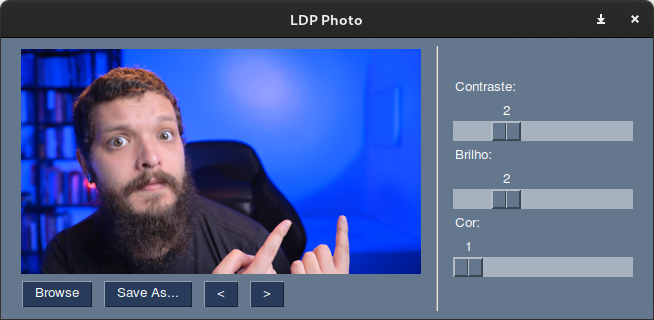

# Photo editor

Um editor de fotos minimalista criado durante as lives de python para exemplificar conceitos de algumas lives.



Lives em que esse editor foi usado:

- [Pathlib](https://youtu.be/cHraQ2I0Xgk)
- [pysimplegui](https://youtu.be/1xGLzxV4qq4)
- [profilling](https://youtu.be/E_hox7iZjOE)

### Como executar esse projeto

```py
poetry install
poetry shell
python photo.py
```
